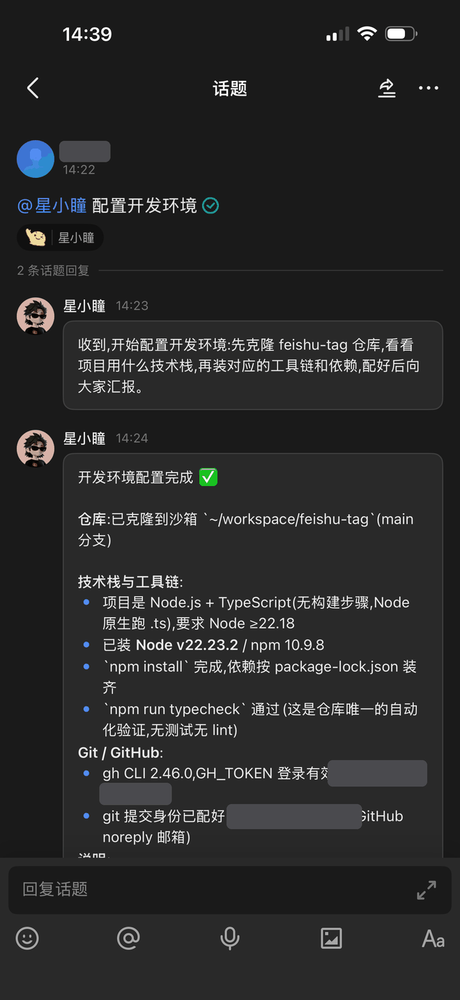
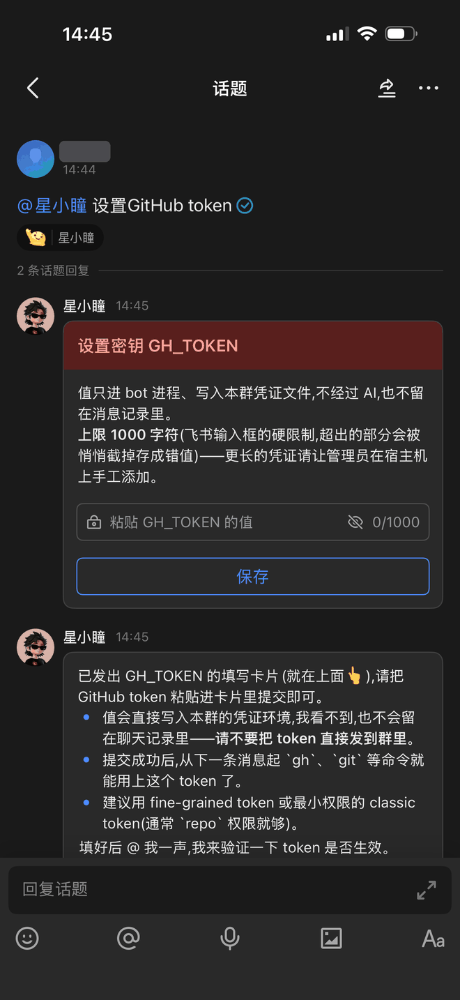

# feishu-tag

飞书群里的 AI 同事,它有自己的电脑,使用群进行权限隔离。

## 前置条件

- **一个能建自建应用的飞书账号** —— 要企业管理员,或者管理员给过「创建应用」权限。
- **macOS 或 Linux 电脑**
- **一份模型令牌** —— Claude 订阅(`claude setup-token` 生成)或 Anthropic API key,二选一。

## 运行

```bash
curl -fsSL https://raw.githubusercontent.com/singtown/feishu-tag/main/install.sh | bash
```

1. 使用飞书扫码创建机器人
2. 输入模型令牌
3. 装完把机器人拉进群,@ 它说句话。mac 首次启动要建虚拟机,约几分钟;每个群第一次说话要建自己的沙箱,约 1 分钟

## 特色

- 每个群有一台自己的 Linux 机器,装过的软件、攒下的文件长期保留,下次接着用
- 用群做隔离边界:工作区、密钥、长期记忆都是一群一份,群与群互相看不见
- 回答发进话题(分支),一个问题一段独立上下文,几个人同时问几件事也不会串,也不刷屏
- 第三方密钥不经过 AI,直接使用卡片输入

## 常见场景

<p>
  
  
</p>

> **@bot** 局域网 10.0.0.8 那台 Mac,用户名 ci,iOS 打包用它
>
> ↳ **bot** 在沙箱里生成了 SSH 密钥,把这段公钥加到那台 Mac 的 authorized_keys:`ssh-ed25519 AAAA…`
>
> 之后说「打个 TestFlight 包」,它就 ssh 过去跑 xcodebuild,结果带回话题

> **@bot** 官网首页在手机上导航栏错位了
>
> ↳ **bot** 复现了,是 header 那个 flex 容器没设 min-width。改完跑过构建,PR #128

## FAQ

**为什么用 Incus 而不是 Docker?**
机器人需要的是一台真正的电脑,相比于 Incus,Docker 有以下缺点:
- 重建就回到镜像初始状态,agent 装过的软件、攒下的环境全丢
- 嵌套不了下一层虚拟化,群里让它跑 Docker/Incus 实现不了
- 没有 systemd,装服务、开机自启都做不了

**为什么不搞多角色 AI(产品经理、程序员、测试各一个)?** 人类分工是因为单人能力有限、
知识有限、效率有限,不得不拆;AI 没有这些限制,一个 agent 就装得下全部角色。硬拆成
多角色,角色之间还得互相转述上下文,效率变低、token 暴增,只有坏处没有好处。

**为什么不用企业微信?** 分支回复没有 API——话题(分支)是"一个问题一段独立上下文"的
基础,企微发不出来;而且企微只给得到 @ 机器人的那一条消息,群里其他消息拿不到。

---

本项目由 [Claude Tag](https://www.claude.com/claude-in-slack) 启发。

MIT License
